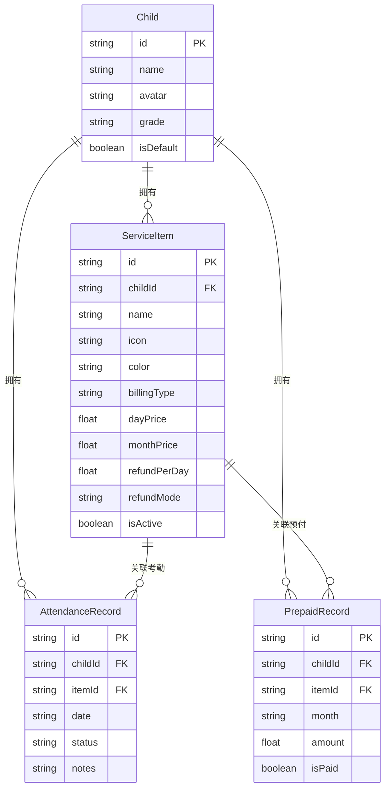

# “伴学小账” (BentoCare) 技术与产品设计方案

## 一、 产品概述与背景

家庭在记录孩子在校/托管的午餐、小饭桌、晚托、接送等日常考勤时，经常面临“包月费用已交，但孩子请假后退费核算繁琐、账单不清”的问题。“伴学小账 (BentoCare)” 是一款面向家庭移动端 H5 优先的考勤打卡与“按天计费 / 按月预付 + 缺勤退费”自动核算对账工具。

- **产品定位**：家庭与托管机构/小饭桌考勤对账助手
- **英文代号**：BentoCare
- **核心价值**：出勤一键打卡，缺勤自动退费，月底一键生成对账长图

---

## 二、 核心业务规则与计费模型

### 1. 托管项目类型 (Service Items)
每个孩子可以配置多个活跃项目（如：学校午餐、小饭桌、晚托班、校车接送等）。

| 计费模式 | 模式标识 | 业务规则 |
| :--- | :--- | :--- |
| **按天计费 / 后付** | `PER_DAY` | 实际出勤时累加单日费用；请假/缺席为 0 元。适用于次卡接送、按日晚托。 |
| **按月预付 + 缺勤退费** | `PER_MONTH` | 月初预付固定包月费用；标记缺席（病假/事假/调休）时触发单日退费。适用于午餐、小饭桌。 |

### 2. 缺勤退费计算规则
对于按月提前付费项目，每日费用与退费标准全面支持可配置化：
1. **当月法定工作日均摊 (`WORKDAY_DIVIDED`)**：
   $$\text{单日退费金额} = \frac{\text{当月预付包月总额}}{\text{当月法定计费工作日天数} \times \text{人数}}$$
   根据国家法定节假日及调休后的实际在校天数动态精准折算。
2. **固定天数折算 (`FIXED_DAYS_DIVIDED`)**：
   $$\text{单日退费金额} = \frac{\text{当月预付包月总额}}{\text{配置的每月固定天数(如22天)} \times \text{人数}}$$
   适用于机构统一按每月固定 22 天、21.75 天或自定义固定天数折算每日餐费/托费。
3. **当月自然天数折算 (`CALENDAR_DIVIDED`)**：
   $$\text{单日退费金额} = \frac{\text{当月预付包月总额}}{\text{当月日历总天数 (28~31天)} \times \text{人数}}$$
4. **固定单日退费金额 (`FIXED`)**：
   $$\text{单日退费金额} = \text{refundPerDay} \quad (\text{如固定每天退 60 元})$$

### 3. 结算核算公式
对于按月项目：
$$\text{项目实耗金额} = \text{预付包月总额} - (\text{缺席天数} \times \text{单日退费标准})$$

对于按天项目：
$$\text{项目实耗金额} = \text{出勤天数} \times \text{单日计费标准}$$

月度总对账单汇总：
$$\text{总实际应付净额} = \sum \text{按月项目实耗金额} + \sum \text{按天项目实耗金额}$$
$$\text{核销后结余差额} = \text{总预付金额} - \text{总实际应付净额} = \text{缺勤应退总额} - \text{按天总消费}$$

---

## 三、 系统架构与数据库设计

### 1. 技术栈选型
- **前端核心**：Next.js 14 App Router + React 18/19 + TypeScript
- **样式与交互**：Tailwind CSS + Lucide Icons + html-to-image + canvas-confetti
- **ORM 与数据库**：Prisma ORM + PostgreSQL (Vercel Postgres 原生适配)
- **部署方案**：Vercel Serverless + Vercel Postgres Storage

### 2. 数据库实体模型 (Prisma Schema)

---

## 四、 功能架构与页面规划

1. **考勤打卡看板 (`/`)**
   - 顶部孩子快速切换与月份选择器
   - 当月日历网格：出勤（绿点）、请假退费（红点）、休息（灰点）
   - 单日打卡抽屉：单项状态切换、请假原因备注录入
   - 快捷批量条：今日打卡直达、一键全部出勤、一键全部请假
2. **对账与报表中心 (`/bills`)**
   - 月度结算大卡片：预付总额、缺勤应退、按天消费、实付净额、差额结余
   - 各项目扣费与退费公式明细清单
   - 缺勤日期与备注溯源（如“发烧请假”、“学校秋游免餐”）
   - **微信长图分享**：通过 `html-to-image` 将对账卡片转为高清 PNG
   - **CSV 数据导出**：导出标准对账表格
   - 年度汇总报表：全年支出与退费总览
3. **配置与管理中心 (`/settings`)**
   - 孩子档案管理（新增/编辑/头像/班级）
   - 托管项目管理（单价/退费基准/计费模式）
   - 数据管理（JSON 完整备份与恢复、重置演示数据、Vercel Postgres 连接状态）
